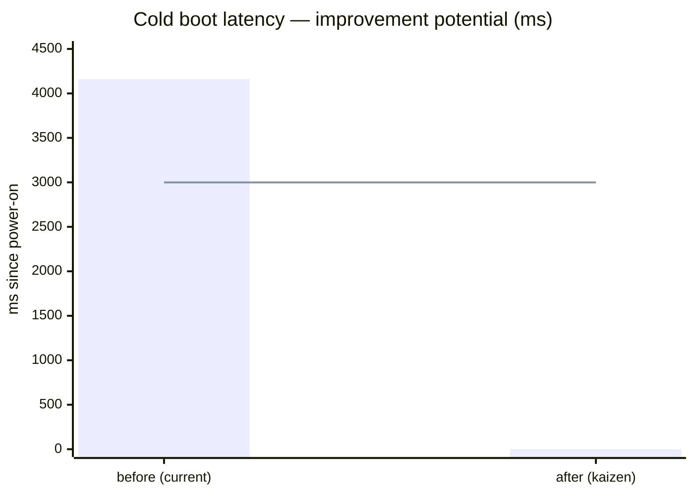
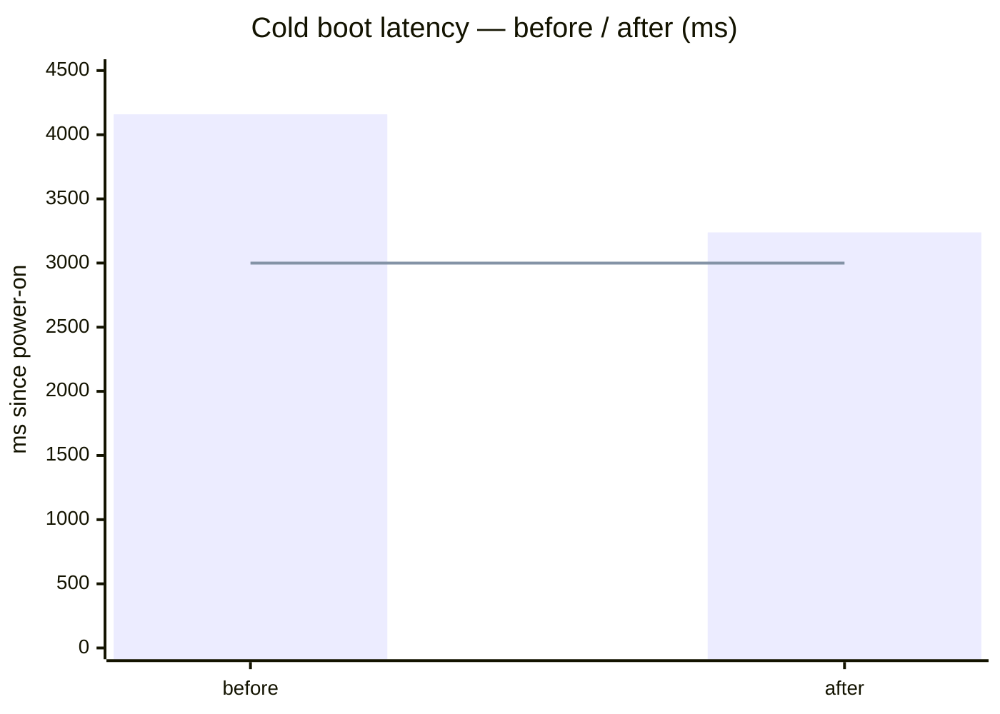

# Kaizen — Cold boot latency

Typoena takes too long from power-on to a usable cursor; the writer waits at the splash before they can type.

## 1) Improvement potential

**Value model for the writer (device user)**

| Want more of | Do less of |
|---|---|
| + Grab-and-write immediacy — feels "instant on" like paper or a typewriter | – Waiting at the splash before the cursor appears |
| + Time spent actually writing | – Cold-boot latency; anything on the critical path that isn't showing your text |

**Measurement**: cold boot latency = power-on → `boot: cursor ready` (`esp_log_timestamp()`, main.rs — captures the full pre-app slice, unlike `esp_timer_get_time()` which misses the ~1.4 s before `app_main`).

| Current method | Target (new method) |
|---|---|
| 4159 ms | ≤ 3000 ms (v1.0 gate) |



After-bar is empty on purpose — the measured result belongs in step 6. The line is the 3000 ms target.

## 2) Current method analysis

Baseline boot, ~4159 ms. `[==]` = a time span. Everything after `app_main` runs **concurrently**, hidden under the splash waveform:

```
  t=0
  pre-app   [== bootloader + PSRAM + MEMTEST  ~1.45 s ==]            #1  pure overhead  -> REMOVABLE
                                                 \__ app_main + EPD init (~0.1 s)
  splash                                            [====== splash full-refresh ~2.2 s ======]   #2  e-ink FLOOR (0xD7, BUSY-gated)
  storage                                           [ SD -> prefs -> note -> snippets ~1.3 s ]    #3  hidden under waveform (off crit path)
  walk                                              [ palette walk 5.4 s ..... holds FatFS lock .....>   #4  latent lock contention
  render                                            (waits for splash) ......... [ first partial ]      #5  small
                                                                                              |
                                                                                        cursor ready ~4159 ms
```

| Factor # | Factor | Hypothesis | Test method | Test result | True or false? |
|---|---|---|---|---|---|
| 1 | Pre-app slice (~1.45 s) | PSRAM memtest + 160 MHz `.data`/`.rodata` copy — pure overhead, no behaviour on a soldered known-good board | Read `app_main` timestamp; toggle `CONFIG_SPIRAM_MEMTEST` + CPU freq, remeasure the pre-app delta | 1.45 s → 0.79 s with memtest off + 240 MHz | **TRUE** |
| 2 | Splash full-refresh (~2.2 s) | Irreducible e-ink floor: `0xD7` fast-full OTP waveform, panel-BUSY-bound not CPU-bound | Already async (overlaps storage); vary CPU freq, observe waveform duration | Unchanged at 240 MHz; BUSY-gated ~2.2 s | **TRUE** (floor) |
| 3 | Storage init | Hidden under the waveform — off the critical path | Compare storage-read timestamps to splash-BUSY-clear | Snippets done ~1.3 s app-side ≪ splash clear ~3 s → hidden | **TRUE** (hidden) |
| 4 | Background palette walk (5.4 s) | Shares the FatFS volume lock; can starve the main task's synchronous critical-path reads | Vary spawn position + CPU freq; watch snippets-load vs walk-finish | 160 MHz pre-render: hidden. 240 MHz pre-render: starved snippets (loaded 6.7 s) → **+3 s** | **TRUE** (latent) |
| 5 | First editor partial | Rides on splash-clear, part of the floor | Timestamp splash-clear → cursor-ready | Small — a few hundred ms at most | ~floor |

### Details on hypothesis #4 (the latent one)

The walk isn't a weak point in *today's* boot — at 160 MHz it stays hidden under the waveform like storage does. It's a **trap that shrinking factor #1 springs**: a faster CPU tightens the walk's `readdir`-over-SPI loop so it out-competes the main task for the FatFS volume lock, starving the synchronous snippets read. So it belongs in step 4 (what could go wrong), not as a separate weak point.

**Selected weak point**: **Factor #1 — the ~1.45 s pre-app overhead slice.** Largest *removable* chunk (the waveform #2 is the floor, storage #3 is already hidden), zero behaviour cost on a soldered known-good board, no display-quality tradeoff. Factor #4 is carried into step 4 as a risk, not attacked as a second weak point.

## 3) Ideas

### Bibliography

- ESP-IDF Programming Guide — *Performance → Speed Optimization → Improving Startup Time* (`docs.espressif.com/projects/esp-idf`, v5.5). Enumerates the canonical cold-boot levers: skip the PSRAM memory test, raise the CPU frequency, flash SPI mode/speed (QIO / 80 MHz), bootloader log level, skip image validation, reduce logging. Every idea below maps to a knob this guide documents.

### New ideas

Diverge first (no judging), then keep only what attacks the verified cause (#1, pre-app overhead):

| Name | Est. gain | Est. lead time | Cause addressed | Cost / risk | Comments |
|---|---|---|---|---|---|
| Disable PSRAM memtest (`CONFIG_SPIRAM_MEMTEST=n`) | ~0.55–0.74 s | minutes (1 Kconfig line + fingerprint bust) | #1 | Loses the boot PSRAM integrity scan | Biggest single lever; fine on a soldered known-good N16R8 |
| CPU 160→240 MHz (`ESP_DEFAULT_CPU_FREQ_MHZ_240`) | ~0.1–0.2 s pre-app + app-wide speedup | minutes | #1 | +power; **springs the #4 walk trap** | Also speeds every keystroke/refresh at runtime |
| QIO flash + 80 MHz | ~0.1–0.2 s (segment load) | low | #1 | **HIGH** — can break boot on a marginal part; inert via sdkconfig on the espflash path (needs espflash flags) | **Rejected** — risk ≫ gain |
| Bootloader log level NONE | <0.05 s | minutes | #1 | None | **Inert** on `just flash` (espflash ships its own bootloader); kept only for a future production/OTA image |
| Slim the app image (LTO / opt-size / `panic=abort`) | ~0.05–0.15 s (less `.data`/`.rodata` to copy) | hours + regression test | #1 | Build-tuning risk | Deferred — low gain/effort ratio |
| Deep-sleep instead of cold boot (keep RAM, wake fast) | seconds | large (lifecycle redesign) | bypasses #1 | Battery + different power UX | Out of scope for *cold* boot — a separate kaizen candidate |

**Chosen idea**: **Disable PSRAM memtest + CPU 240 MHz** — the two highest-gain, minutes-of-lead, *zero display-quality-risk* levers, both attacking cause #1. QIO is deliberately **rejected** (brick risk far outweighs ~0.1 s); the bootloader-log lever is kept but flagged inert on our flash path; image-slim and deep-sleep are deferred. One coherent change: the boot-time block of `sdkconfig.defaults`.

## 4) Test plan

**What could go wrong?**

| Lens | Anticipated consequence | Mitigation |
|---|---|---|
| 3S · Stable | **The #4 trap.** The 240 MHz CPU tightens the background palette walk's `readdir` loop so it out-competes the main task for the FatFS volume lock, starving the boot-path snippets read → cursor-ready *regresses*. | **This is exactly what happened** (7.3 s). Fix: spawn the walk *after* the first editor frame, off the hot path. |
| 3S · Stable | Memtest-off hides a defective PSRAM part — a bad module boots silently. | Acceptable on a soldered, known-good N16R8 (`SPIRAM_BOOT_INIT` still brings the pool up, just doesn't walk it). Re-enable temporarily when hand-wiring a new board. |
| Method | The bootloader-log lever is *believed* to silence boot but is inert on the espflash path — someone later trusts it. | Documented inert in the `sdkconfig` comment, commit body, and memory. Kept only for a future production/OTA bootloader. |
| Method | `sdkconfig.defaults` edits don't rebuild via plain `cargo build` — a flash silently runs the OLD config, exits 0, so you measure the wrong thing. | **Also happened.** Bust the `esp-idf-sys` fingerprint + verify the regenerated `out/sdkconfig` before flashing. |
| Lean · Cost | 240 MHz draws more power — shorter battery on the future v0.8 build. | Acceptable now (bench/USB power); revisit as a battery-vs-speed knob when v0.8 lands. |

**Rollback**: the levers and the walk relocation are **one commit** (`perf(boot)`), so `git revert` restores 160 MHz + memtest + pre-render walk as a coherent unit — no half-state that reintroduces the regression.

**Measurement protocol** (for step 6): `just flash`, read `boot: cursor ready — N ms` (`esp_log_timestamp`, real power-on). Confirm `cpu freq: 240000000 Hz`, no memtest line, and that `file walk: … in …ms` logs *after* cursor-ready.

**Who must we convince?** Solo project — no external stakeholders. The one future reviewer to flag is the v0.8 battery work (the 240 MHz power cost).

## 5) Implementation

What changed (not how well — that's step 6).

**Before** — `sdkconfig.defaults` had no boot-time block; `spawn_file_walk()` ran pre-render, right after the boot note loaded.

**After** — boot-time block added, and the walk moved past the first frame:

```diff
# firmware/sdkconfig.defaults  (+ boot-time block)
+CONFIG_SPIRAM_MEMTEST=n
+CONFIG_ESP_DEFAULT_CPU_FREQ_MHZ_240=y
+CONFIG_BOOTLOADER_LOG_LEVEL_NONE=y   # kept, but inert on the espflash flash path
```

```diff
# firmware/src/main.rs  (walk relocated off the boot hot path)
     let (boot_path, boot_scope, saved) = boot_note(&mut epd, &storage, &prefs);
-    // Feed the file palette (Ctrl-P) from a background walk. … [spawned here, pre-render]
-    let (walk_tx, walk_rx) = std::sync::mpsc::channel::<String>();
-    spawn_file_walk(walk_tx.clone());
     // Spawn the dedicated git thread …
 …
     log::info!("boot: cursor ready — {total_ms} ms …");
+    // … spawned only now, AFTER the first editor frame is on the panel …
+    let (walk_tx, walk_rx) = std::sync::mpsc::channel::<String>();
+    spawn_file_walk(walk_tx.clone());
     loop {
```

Boot timeline with the change applied (redraw of step 2 — pre-app shrunk, walk pushed past cursor-ready):

```
  t=0
  pre-app   [== boot + PSRAM  (no memtest, 240 MHz)  ~0.79 s ==]     #1  REMOVED overhead (was ~1.45 s)
                                            \__ app_main + EPD init
  splash                                    [====== splash full-refresh ~2.2 s ======]   #2  unchanged FLOOR
  storage                                   [ SD -> prefs -> note -> snippets ]           #3  still hidden
  render                                    (waits) ...... [ first partial ] --> cursor ready ~3239 ms
  walk                                                                  [ palette walk 5.4 s ..... ]   #4  now AFTER cursor-ready (off hot path)
```

## 6) Evaluation

**Measurement redone** (cold boot latency, ms): **4159 → 3239** (target was ≤ 3000).



−920 ms (−22%). **Target not fully met** — 239 ms over ≤ 3000. Honest read: a strong, zero-risk win, but the last stretch is a different problem.

**Learnings**
- The ~2.2 s splash waveform is the true floor; the removable win was pre-app overhead, and it's now spent.
- A perf lever can *expose* a latent concurrency bug: 240 MHz didn't make the walk slower, it changed the FatFS-lock scheduling — the #4 trap materialised exactly as step 4 predicted. Faster ≠ uniformly faster.
- Watch for *inert* levers on the espflash flash path (bootloader log), and the `sdkconfig` stale-cache trap.

**Standard to update**
- `sdkconfig.defaults` boot-time block is the new baseline (documented inline).
- **Reusable invariant**: background SD walkers must be spawned *after* the critical-path reads and the first paint — never let a background thread hold the FatFS volume lock on the boot hot path.
- Memory `hardware-status` updated with the measured result.

**Share with**: solo project — recorded in the macroplan/QFD; flag the 240 MHz power cost to the v0.8 battery work.

**Next steps**
- ≤ 3000 ms is not met (239 ms short). The only remaining lever is a faster splash waveform (custom `0x32` LUT) — **its own kaizen**, gated on a display-quality decision (ghosting risk).
- Optional/tangential: intern the file list to reclaim the ~182 KB internal DRAM the walk consumes.
- Consider a 160 MHz-on-battery knob when v0.8 lands.
