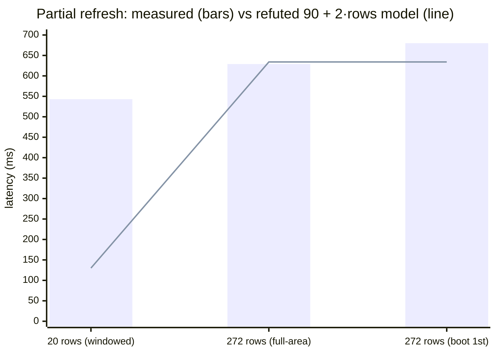

# E-ink refresh latency vs rows driven

> **Model (corrected 2026-07-16):** on this GDEY0579T93 (SSD1683 dual-controller)
> panel, refresh time is set by **which waveform LUT runs** — full-clear
> (~1870 ms) or partial (~540 ms floor) — plus a small SPI-transfer term that
> scales with the rows written (~0.34 ms/row at 4 MHz). Rows driven do **not**
> shorten the waveform itself: the gate-scan spike refuted MUX-proportional
> timing
> ([postmortem](../postmortems/2026-07-16-gate-scan-spike-refuted.md)), killing
> this doc's original `90 ms + 2 ms · rows` model. This is the cost model behind
> per-keystroke typing, the boot splash→editor swap
> ([`../notes/boot-time-budget.md`](../notes/boot-time-budget.md)), and the
> scroll/gutter spikes.
>
> Tradeoff-curves index: [`README.md`](README.md). Docs index:
> [`../README.md`](../README.md). Driver:
> [`../../firmware/src/epd.rs`](../../firmware/src/epd.rs). Bench origin:
> Spikes 5 + 8 ([`../spikes.md`](../spikes.md)); measured points from the
> 2026-07-16
> [bank-toggle](../postmortems/2026-07-16-partial-refresh-bank-toggle.md) and
> [gate-scan](../postmortems/2026-07-16-gate-scan-spike-refuted.md) sessions.

## The model

A refresh is three serial costs:

```
set RAM window  →  clock the pixels out over SPI  →  run the update waveform
   (fixed)          (scales with bytes = rows:         (fixed per LUT tier —
                     3 band writes at 4 MHz)            does NOT scale with rows)
```

- **The LUT sets the tier — and the floor.** A _partial_ update (`0x22`←`0xFF`)
  plays a short phase schedule that only nudges pixels that changed; a _full_
  update (`0x22`←`0xD7`, the fast-full LUT) plays ~3× as many frames to fully
  clear-and-set — slower, but it erases ghosting and re-establishes a known
  image. BUSY ends when the phase schedule ends, **however many gates were
  driven** — refresh duration lives in the LUT, not the scan.
- **Row count only trims the SPI transfer.** Each partial writes the band three
  times (`0x24` before the waveform, `0x26`+`0x24` resync after — see the
  [bank-toggle postmortem](../postmortems/2026-07-16-partial-refresh-bank-toggle.md)),
  so a full-area partial moves ~41 KB at 4 MHz (~86 ms) where a one-line band
  moves ~3 KB (~6 ms). That transfer is the *entire* difference between
  windowed and full-area.
- **Column width (X) is free to keep full.** The panel is a master (`0x00`) +
  slave (`0x80`) pair with the framebuffer split at the seam; every refresh
  drives _both_ controllers full width so the seam/mirror math stays intact
  (`update_part` / `write_frame_bank` in
  [`epd.rs`](../../firmware/src/epd.rs)).

Fitted through the two measured partial points:

```
t_partial(rows) ≈ 536 ms + 0.34 ms · rows
                  └ LUT waveform ┘  └ SPI: 3 band writes at 4 MHz ┘
```

Full refresh sits in its own flat tier (~1870 ms, full-clear LUT) and cannot be
windowed — the clear waveform needs the whole panel.

## The points

All measured on-device via the per-refresh log
(`{mode} refresh #N … {ms} ms` in [`main.rs`](../../firmware/src/main.rs)):



Bars are the measured partials; the line is what the old linear model
predicted. At 272 rows the two agree within 5 ms — that's where the model was
calibrated, which is how it survived until the first windowed bench. The
20-row point (543 ms measured vs ~130 ms predicted) is the refutation.

| Point                       | Rows |     Latency | LUT        | Source                                                                                       |
| --------------------------- | ---: | ----------: | ---------- | -------------------------------------------------------------------------------------------- |
| Windowed one-line band      |   20 |  **543 ms** | partial    | [bank-toggle session](../postmortems/2026-07-16-partial-refresh-bank-toggle.md)              |
| Full-area partial           |  272 |  **629 ms** | partial    | same session (630 ms in Spike 5)                                                             |
| Full-area partial, at boot  |  272 |  **680 ms** | partial    | boot log (splash→editor swap)                                                                |
| Full refresh                |  272 | **1870 ms** | full-clear | Spikes 5 + 8                                                                                 |
| ~~Spike: 20-gate MUX scan~~ |   20 |      571 ms | partial    | [gate-scan spike](../postmortems/2026-07-16-gate-scan-spike-refuted.md) — reverted, hazard   |
| ~~Spike: 272-gate trim~~    |  272 |      690 ms | partial    | same spike — even the "free" 272-vs-300 trim bought nothing                                  |

## Two things that bound it

**Ghosting caps the partial streak.** Partial updates leave faint residue, so a
full refresh every 64 updates resets clarity and panel state. You can't "always
partial" — the ~1870 ms tier is a periodic tax paid for longevity, not a mode you
can retire.

**The first cold-boot image must be a full refresh.** After power-on the `0x26`
"previous" bank holds garbage, and a partial refresh _diffs against it_ — so the
very first clean paint has to be the full tier. This is why boot pays exactly one
unavoidable ~1.9 s full refresh, and why the splash (which rides it) is nearly
free while the _editor's_ first frame can be a cheap partial on top. Full
derivation: [`../notes/boot-time-budget.md`](../notes/boot-time-budget.md).

## What it decides

- **Per-keystroke typing → ~545 ms per batch, whatever the window.** Additive
  Insert edits still take the windowed band (it's the cheapest mode and skips
  ~80 ms of SPI), but the flat waveform means typing feel is set by the LUT
  floor, not by how little changed. Type-ahead absorbs keystrokes during the
  refresh, so this is per *batch*, not per key.
- **The clean-erase policy is nearly free.** Deletes, caret moves, mode flips,
  and the snackbar take the full-area partial to avoid windowed erase ghosts —
  under the old model a ~500 ms penalty, under the real one ~86 ms of SPI.
- **Boot splash→editor → full-area partial (~680 ms), not a second full refresh
  (~1870 ms).** The splash already seeded the baseline, so the editor rides in
  on a partial — the ~1.2 s cold-boot win recorded in the boot-time budget.
- **Splash + periodic → full refresh.** The unavoidable first image and the
  every-64 de-ghost.

## Levers on the ~540 ms floor

Candidates, ranked by expected payoff against risk. Results tracked in the log
below — this table is the standing menu; the log records what each flash showed.

| Lever                                | Touches waveform? | Expected      | Risk                                                          | Status                                    |
| ------------------------------------ | ----------------- | ------------- | ------------------------------------------------------------ | ----------------------------------------- |
| **Temperature-select (`0x1A` sweep)** | no — factory OTP LUT, hotter index | ~350 ms? if the partial LUT is temp-speed-indexed | ghosting if the hot LUT under-drives at room temp; fully reversible | **testing** — see log                     |
| Async partial + idle bank resync     | no — pure firmware | hides ~86 ms SPI + draw off the cadence; erase path 629→~565 ms | none (RAM is source of truth)               | not started                               |
| SPI clock 4 → 10 MHz                 | no                | full-area SPI 86→~34 ms (subsumed by pipelining) | signal integrity on the wiring              | not started                               |
| Custom partial LUT via `0x32`        | **yes — authored** | ~100–200 ms (reported on similar panels) | ghosting, DC balance/longevity, temperature, no reference waveform — [postmortem](../postmortems/2026-07-16-gate-scan-spike-refuted.md) | parked (this is "touching the LUT")       |
| ~~Gate-scan restriction (`0x01`/`0x0F`)~~ | no | — | **refuted + hazard**: MUX-independent timing, mirrors the panel (OTP gate config, write-only) | closed — never write these registers      |

### Experiment log — temperature-select sweep

**What it tests.** The partial's `0x22 ← 0xFF` reloads temperature + LUT from the
`0x1A` register on every refresh. `init()` leaves that register at `[0x64, 0x00]`
(~100), so the 543 ms baseline *already* runs at temp 100 — the spike sweeps the
register above and below that to find out whether the partial OTP LUT's schedule
is temperature-indexed the way the fast-full LUT is. Higher = faster would open
the lever; flat across the sweep proves the floor is fixed and closes it.

**How to run.** Set `PARTIAL_TEMP` in [`epd.rs`](../../firmware/src/epd.rs),
flash, type, read `windowed refresh #N … {ms} ms` from the serial log. Note
ghosting over a full ~64-partial streak (shorter drive shadows sooner), not just
the first refresh. `[0x64, 0x00]` reproduces the baseline as a control.

| `0x1A` value  | Windowed (20-row) ms | Full-area (272) ms | Ghosting over 64-streak | Verdict | Date |
| ------------- | -------------------: | -----------------: | ----------------------- | ------- | ---- |
| `[0x64,0x00]` (baseline, init default) | 543 | 629 | clean (current shipping) | control | 2026-07-16 |
| `[0x7F,0x00]` (hotter) | 562–571 | 693 (#1) | not evaluated (no gain to justify) | **no gain** — flat vs baseline, if anything +20 ms from the extra command | 2026-07-17 |
| `[0x19,0x00]` (cold ~25) | _pending_ | _pending_ | _pending_ | discriminator (see below) | _pending_ |

Notes as we go:

- **2026-07-17 — hotter than default buys nothing.** `0x7F` (127) vs the `0x64`
  (100) init default: windowed 562–571 ms, flat with the 543 ms baseline. So
  going *above* the shipping temperature does not shorten the partial waveform.
  Two live explanations, which the cold `0x19` flash discriminates:
  - **We're already on the hot plateau.** If the OTP partial LUT has a
    fast-above-threshold schedule and `0x64` already clears it, then only a
    *colder* value would be slower. → cold `0x19` runs **slower** than 543 ms.
  - **The write is ignored.** `0x18 ← 0x80` selects the internal sensor; if
    "load temperature" reads the sensor and not our register, `0x1A` never
    mattered. → cold `0x19` reads **flat** at ~543 ms.

  Either way, **temperature is not a lever to go *faster* than the ~543 ms
  floor** — hotter is the only direction that could help and it didn't. The
  cold flash is confirmatory (closes the mechanism question in the log); it
  cannot itself improve responsiveness. After it, restore `PARTIAL_TEMP = None`
  and move to the async-pipelining lever.

### Other levers — not started

- **Async partial + idle bank resync.** Mirror `display_frame_async` for
  partials (write `0x24` band, kick `0x20`, return) and move the post-BUSY
  `0x26`+`0x24` resync to the head of the next refresh. Perceived latency drops
  to band-write + waveform; the CPU is free during BUSY. Invariant: resync must
  finish before the next `0x24` write — the existing `refresh_pending` /
  `wait_ready` discipline is the home for it.
- **SPI clock.** [`main.rs`](../../firmware/src/main.rs) drives the bus at
  4 MHz; SSD1683-class parts take 10–20 MHz. Only helps the full-area path's SPI
  term, which pipelining already hides — do it *instead of*, not on top of.
